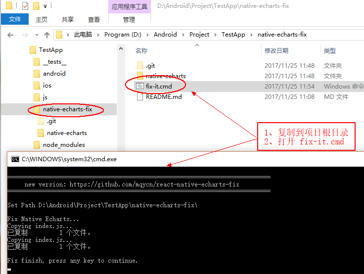

# 一键修复 react-native-echarts 各种小问题

**安卓打包正式版不能加载的问题**

  本工具参考：[debug正常，但是release还是不显示](https://github.com/somonus/react-native-echarts/issues/12)
  
  为了避免和其他项目冲突，复制 的 tpl 路径为：android_asset/echarts/tpl.html

**图表加载时的白屏问题**

  使用了 和 Echart 一样的定义接口。传入 option时，设置 backgroundColor 即可

  如果不指定 option.backgroundColor，则背景为透明
  
```
  // code...
  getInitialState(){
    return {
      echart: {
        backgroundColor: 'red'	//设置初始背景色
      }
    };
  },
  // code...
  render(){
    return (
      <View>
        <Echarts option={this.state.echart} />
      </View>
    );
  },
  // code...
```

**使用说明**



现在只支持 Windows 下的自动修复

需要将本工具安装到 您的 APP 根目录，然后运行 react-native-echarts-fix/fix-it.cmd

```
YouApp/
   |---- android/
   |---- ios/
   |---- node_modules/
   |---- react-native-echarts-fix/
   |        |---- react-native-echarts-fix/native-echarts/
   |        |---- react-native-echarts-fix/fix-it.cmd
   |---- index.android.js
   |---- index.ios.js
   |---- package.json
```

